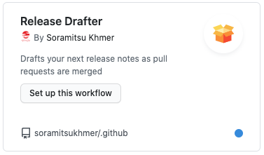
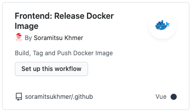

# Documentations

**Contents**
- [Workflows](#workflows)

## Workflows

Workflow are shared across entire @soramitsukhmer organization.

Some workflow required additional configurations.

**Global**

- [Release Drafter](https://github.com/release-drafter/release-drafter#readme)
    - Template: [workflow-templates/release-drafter.yml](https://github.com/soramitsukhmer/.github/blob/main/workflow-templates/release-drafter.yml)
    - Config: [workflow_configs/release-drafter.yml](https://github.com/soramitsukhmer/.github/blob/main/docs/workflow_configs/release-drafter.yml)

        

### Frontend workflows

- Lint and Unit Test
    - Using: ESLint and Jest
    - Template: [workflow-templates/frontend-lint-and-test.yml](https://github.com/soramitsukhmer/.github/blob/471846d3c29ec6a38a6d3923996b0be2f3c09c5a/workflow-templates/frontend-lint-and-test.yml)

        

- [Release Docker Image](https://github.com/docker/build-push-action#readme)
    - Template: [workflow-templates/frontend-docker-release.yml](https://github.com/soramitsukhmer/.github/blob/471846d3c29ec6a38a6d3923996b0be2f3c09c5a/workflow-templates/frontend-docker-release.yml)

        
